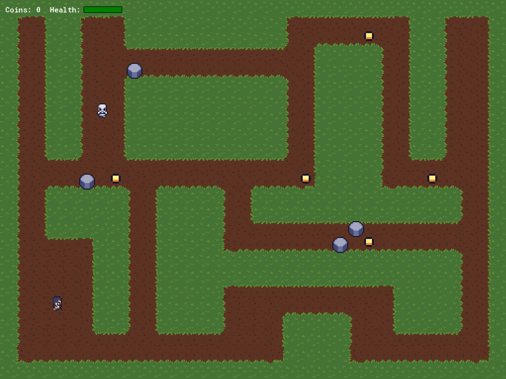
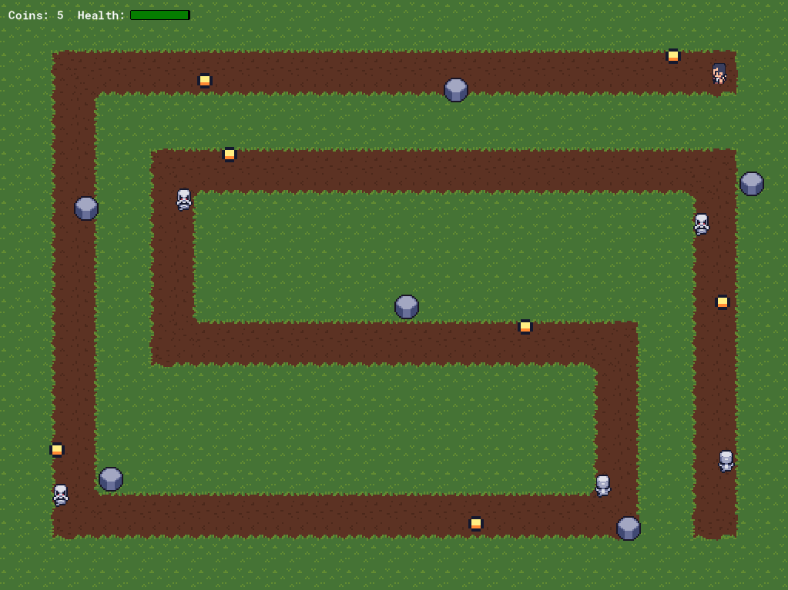

# Bobs-Adventure
Third GameMaker Studio 2 project for my CIT160 course (Game and Simulation Programming)

## Purpose
Learn more about objects, sprites, animation, sounds, and level design in GameMaker

## Goal
Explore the room and pick up coins while avoiding obstacles. After picking up coins, a door will appear. Each door leads Bob to a new level with increased difficulty.

